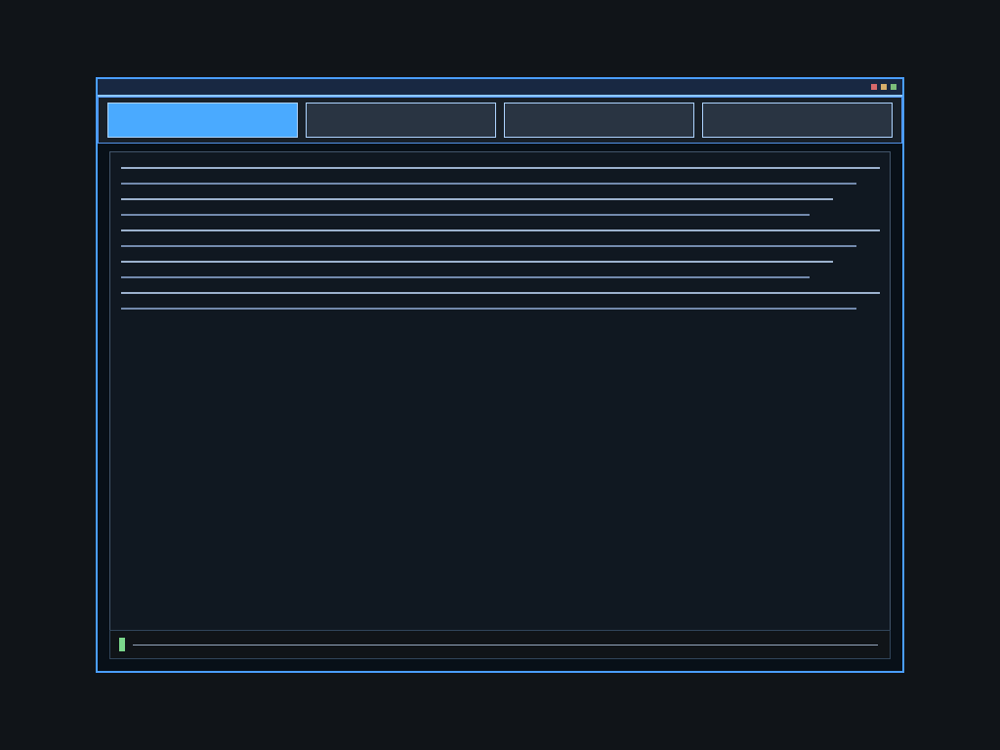

<div align="center">
  <h1>Alloy OS</h1>
  
  
  <p><strong>An OS made in Rust, C/C++, and Assembly</strong></p>
</div>

## fucking information
```bash
# use linux because ts don't compile on windows
make iso

# or be lazy after making iso for the first time
make lazy

# debug (headless qemu)
make output

# boot headless, wait for first rendered desktop frame, then save screenshot png
make screenshot

# boot headless and run scripted mouse smoke interactions
make mouse-smoke

# run scripted mouse interactions and capture png proof
make mouse-screenshot
```

## what does alloy os look like?


this is what it looks like so far.

## display modes (keyboard + mouse)
the kernel now boots the display-server in **Iced-primary mode** first. in this mode, shell launcher/grid surfaces are not created, so the old desktop-shell grid no longer competes with the primary GUI window.

- primary boot mode: `BootUiMode::IcedPrimary`
- fallback mode (on primary init failure): `BootUiMode::DesktopShell`
- desktop-shell source remains in `os/display/apps/desktop_shell.rs`

### controls
- **ESC**: exit display mode
- **`**: toggle keyboard window-control mode
- **1 / 2 / 3 / 4** (normal mode): switch active Iced panel
- **P** (normal mode): toggle palette overlay
- **T / Space** (normal mode): toggle accent brightness
- **PgUp / PgDn**: cycle focused window
- **Arrow keys** (control mode): move focused window
- **+ / -** (control mode): resize focused window
- **M** (control mode): minimize focused window
- **H** (control mode): hide focused window
- **R** (control mode): restore next hidden/minimized window
- **C / X** (control mode): close focused window
- **Mouse move**: moves on-screen pointer
- **Left click**: focus top-most window under pointer
- **Left-drag (title bar)**: drag focused window
- Mouse input is relative PS/2 input; click inside the QEMU window to grab pointer input.
- `make output` is headless and cannot capture live host mouse input (use `make run` or `make mouse-smoke`).

### terminal core utilities
when Alloy falls back to terminal mode, these built-in commands are available:

- `help [command]` - list commands or show detailed help
- `clear`, `echo`, `version`
- `sysinfo`, `uname`, `free`, `ticks`
- `meminfo`, `cpuinfo`, `uptime`

### default-boot promotion gate
the display-server + window-manager path should stay gated until all are true:
- wm + shell unit tests pass in `os/display` (focus/state/bounds + shell behavior)
- kernel builds cleanly with the display-server path integrated (`make`)
- headless runtime smoke (`make output`) exercises primary window focus/move/resize/close/respawn without lockups
- desktop-shell + terminal fallback remain intact if primary boot initialization fails
